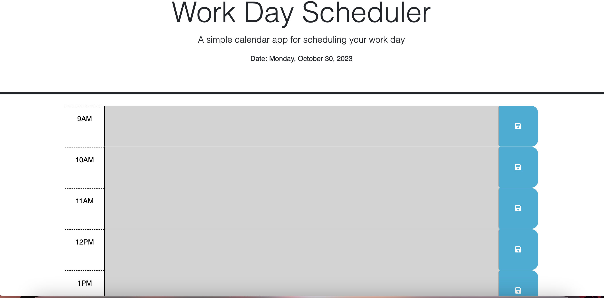

# Calendar-Planner

## Description

A work day scheduler can be a useful tool to use to keep track of tasks that the user will need to complete throughout their busy day. The calendar is set up from 9AM to 5PM with a color coding system. Gray indicates the past time, red is the current time, and green indicates the time blocks that have not been reached yet. Day.js was used to work with the date and time. As a bootcamp student, it's important to keep learning how to use javascript such as functions, and understanding third-party API's. 

## User Story

AS AN employee with a busy schedule
I WANT to add important events to a daily planner
SO THAT I can manage my time effectively

# Acceptance Criteria

GIVEN I am using a daily planner to create a schedule
WHEN I open the planner
THEN the current day is displayed at the top of the calendar
WHEN I scroll down
THEN I am presented with timeblocks for standard business hours of 9am&ndash;5pm
WHEN I view the timeblocks for that day
THEN each timeblock is color coded to indicate whether it is in the past, present, or future
WHEN I click into a timeblock
THEN I can enter an event
WHEN I click the save button for that timeblock
THEN the text for that event is saved in local storage
WHEN I refresh the page
THEN the saved events persist

## Installation

N/A

## Usage

When the application is opened, the current day is displayed at the top. The user can edit each time block to enter in a specific task they would like to complete during each hour of their work schedule. Click the blue save button on the right of each time block. The events will still be there if the page is refreshed. Each row will change color as time goes on to visualize the time change from gray (past), red (present), green (future).

## Deployed Link 

https://spadilla512.github.io/calendar-planner/

## Credits

The starter code for the index.html and css stylesheet for this project was used from a repository named crispy-octo-meme which can be accessed through the following link: https://github.com/coding-boot-camp/crispy-octo-meme.git

## License

Please refer to LICENSE in the repository. 